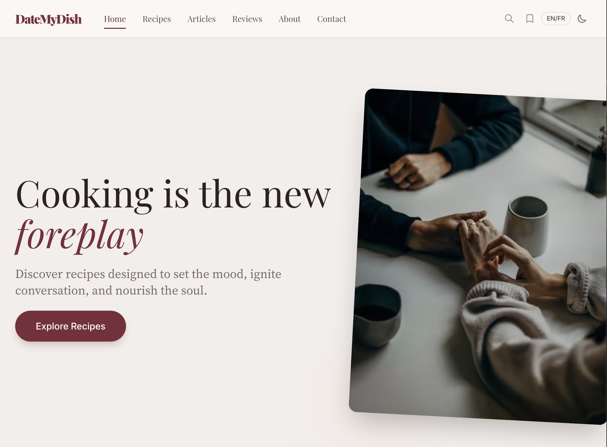
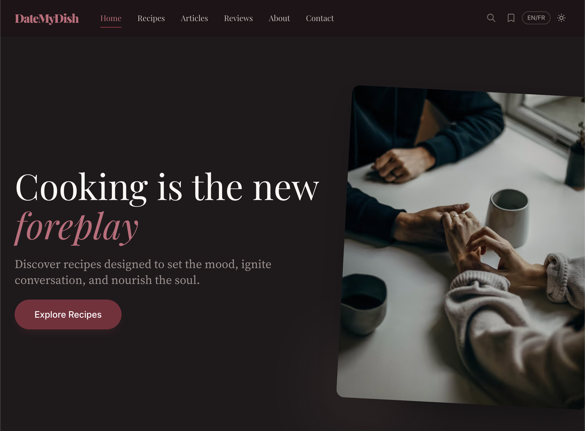

<div align="center">


### Elevate your dinner. Impress your date.

A bilingual recipe blog for couples who believe great food is the secret ingredient to a memorable evening.

**[datemydish.com](https://datemydish.com)**

[](https://astro.build)
[](https://typescriptlang.org)
[](https://tailwindcss.com)
[](https://pages.cloudflare.com)
[](https://playwright.dev)
[](#license)

</div>

<br />

<p align="center">
  
  
</p>

---

## Table of Contents

- [About](#about)
- [Features](#features)
- [Tech Stack](#tech-stack)
- [Getting Started](#getting-started)
- [Project Structure](#project-structure)
- [Commands](#commands)
- [Content Authoring](#content-authoring)
- [CI/CD & Automation](#cicd--automation)
- [Brand](#brand)
- [License](#license)

## About

Date My Dish is a curated collection of date-night recipes, food articles, and Montreal restaurant reviews. Wine pairings, plating tips, and music suggestions set the mood. Every piece of content is available in English and Quebec French with an "impress factor" rating so you know exactly how much wow you're bringing to the table.

**Content at a glance:** 13 recipes, 8 articles, 2 restaurant reviews (and growing weekly via automated pipelines).

## Features

- **Bilingual (EN/FR)** - Every piece of content exists as an EN/FR pair with Quebec French conventions
- **Three Content Types** - Recipes, food science articles, and Montreal restaurant reviews
- **Date Night Tips** - Wine pairing, playlist, and plating suggestions on select recipes
- **Impress Factor** - 1-5 heart rating to match ambition to skill level
- **Dark Mode** - System-aware with manual toggle, persisted in localStorage
- **Full-Text Search** - Pagefind-powered overlay with keyboard navigation
- **Print-Optimized** - Two-column print layout with ink-saving styles
- **Rich SEO** - JSON-LD (Recipe, Article, FAQPage, BreadcrumbList), OpenGraph, hreflang, sitemap
- **AI-Friendly** - `robots.txt` allows AI crawlers; `/llms.txt` endpoint for LLM discovery
- **Auto-Publishing** - Notion to MDX pipelines auto-generate recipes, articles, and reviews via GitHub Actions
- **Social Automation** - New content auto-posts to Instagram and Pinterest with AI-generated captions
- **Accessible** - WCAG 2.2 AA: focus traps, skip-to-content, reduced-motion support, contrast-checked colors

## Tech Stack

| Layer | Technology |
|-------|-----------|
| **Framework** | [Astro 5](https://astro.build) + TypeScript (strict) + MDX |
| **Styling** | [Tailwind CSS 3.4](https://tailwindcss.com) with class-based dark mode |
| **Content** | MDX with Zod-validated frontmatter schemas (recipes, articles, reviews) |
| **Search** | [Pagefind](https://pagefind.app) - static, zero-JS search indexing |
| **i18n** | Subdirectory routing (`/en/`, `/fr/`) with type-safe translations |
| **Images** | Astro `<Picture>` with AVIF/WebP, compile-time optimization |
| **Hosting** | [Cloudflare Pages](https://pages.cloudflare.com) via Wrangler |
| **Testing** | [Playwright](https://playwright.dev) E2E + [Lighthouse CI](https://github.com/GoogleChrome/lighthouse-ci) |
| **AI** | Claude API for content generation and social media captions |
| **CI/CD** | GitHub Actions (auto-publish, SEO audits, dependency updates) |

## Getting Started

**Prerequisites:** Node.js 18+

```bash
git clone https://github.com/victortrinh/date-my-dish.git
cd date-my-dish
npm install
npm run dev
```

## Project Structure

<details>
<summary><strong>Click to expand</strong></summary>

```
src/
├── assets/images/
│   ├── recipes/              # Recipe photos (hero + step images)
│   ├── articles/             # Article hero images
│   └── reviews/              # Review hero images
├── components/               # 35 Astro components (cards, search, nav, SEO schemas...)
├── content/
│   ├── recipes/{en,fr}/      # Recipe MDX files (13 EN + 13 FR)
│   ├── articles/{en,fr}/     # Article MDX files (8 EN + 8 FR)
│   └── reviews/{en,fr}/      # Review MDX files (2 EN + 2 FR)
├── i18n/                     # Translation files + utility functions
├── layouts/                  # BaseLayout, RecipeLayout, ArticleLayout
├── pages/
│   ├── en/                   # English routes
│   └── fr/                   # French routes
├── styles/                   # Global CSS + print styles
└── utils/                    # Helpers (social posting, formatting, SEO)
scripts/                      # Notion fetch, SEO ranking, Lighthouse/Playwright helpers
data/                         # SEO snapshots, social post logs
tests/                        # Playwright E2E specs + fixtures
.github/workflows/            # 10 automation workflows
```

</details>

## Commands

| Command | Description |
|---------|-------------|
| `npm run dev` | Start dev server |
| `npm run build` | Production build (Pagefind runs via postbuild) |
| `npm run preview` | Build + local Cloudflare Workers preview |
| `npm run check` | TypeScript and content schema validation |
| `npm run deploy` | Build + deploy to Cloudflare Pages |
| `npx playwright test` | Run Playwright E2E tests |

## Content Authoring

<details>
<summary><strong>Adding a recipe</strong></summary>

Each recipe is an MDX file with YAML frontmatter for ingredients, instructions, nutrition, and FAQs. The MDX body is SEO blog prose (800-1500 words).

1. Create `src/content/recipes/en/your-recipe.mdx` with full frontmatter
2. Create the French translation in `src/content/recipes/fr/` linked via `translationSlug`
3. Add optimized images to `src/assets/images/recipes/`
4. Both files share the same images; only alt text is translated

See `src/content.config.ts` for the complete Zod schema.

</details>

<details>
<summary><strong>Adding an article</strong></summary>

Articles follow the same pattern with lighter frontmatter (no ingredients/instructions).

1. Create `src/content/articles/en/your-article.mdx`
2. Create the French translation in `src/content/articles/fr/` linked via `translationSlug`
3. Add a hero image to `src/assets/images/articles/`
4. Optionally link related recipes via `relatedRecipes` (EN slugs)

</details>

<details>
<summary><strong>Adding a restaurant review</strong></summary>

Reviews include restaurant-specific frontmatter (address, cuisine, priceRange, dateScore).

1. Create `src/content/reviews/en/your-review.mdx`
2. Create the French translation in `src/content/reviews/fr/` linked via `translationSlug`
3. Add a hero image to `src/assets/images/reviews/`

</details>

## CI/CD & Automation

<details>
<summary><strong>Click to expand</strong></summary>

### Content Publishing
| Workflow | Schedule | Description |
|----------|----------|-------------|
| `auto-publish-recipe.yml` | Thursdays 3AM UTC | Notion to Claude-generated EN+FR MDX + images |
| `auto-publish-article.yml` | Mondays 3AM UTC | Same pipeline for articles |
| `auto-publish-review.yml` | Wednesdays 3AM UTC | Same pipeline for reviews |
| `social-post-on-deploy.yml` | On deploy | Auto-posts new content to Instagram/Pinterest |
| `token-refresh.yml` | 1st + 25th monthly | Refreshes OAuth tokens (Pinterest, Instagram) |

### Quality Gates
| Workflow | Trigger | Description |
|----------|---------|-------------|
| `playwright-pr-check.yml` | PR | E2E smoke tests (desktop/mobile, light/dark) |
| `lighthouse-pr-check.yml` | PR | Performance and accessibility checks |
| `weekly-seo-audit.yml` | Sundays 3AM | Full Lighthouse CI audit |
| `weekly-seo-ranking.yml` | Mondays 8AM | Google Search Console + SERP tracking |
| `seo-auto-optimize.yml` | On ranking data | Claude optimizes underperforming content |

</details>

## Brand

| Element | Value |
|---------|-------|
| **Primary** | Terracotta `#C4704B` (decorative) / `#9A5439` (text, WCAG AA) |
| **Accent** | Warm Gold `#D4A853` (decorative) / `#7D631C` (text, WCAG AA) |
| **Headings** | Playfair Display 400-900 (italic) |
| **Body** | Source Serif 4 400-700 |
| **UI** | Inter 400-700 |
| **Handwritten** | Caveat 400/700 |

## License

All rights reserved. Recipe content, photos, and code are proprietary.

---

<div align="center">

Built with care by **[Victor](https://datemydish.com/en/about/)** in Montreal

</div>
