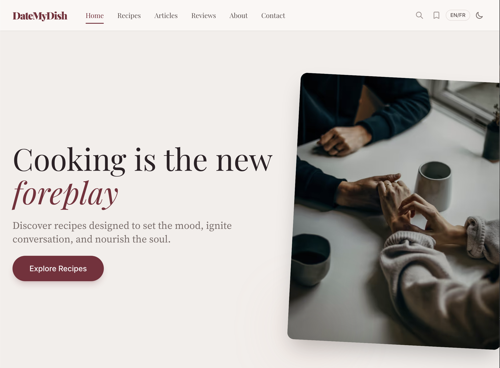
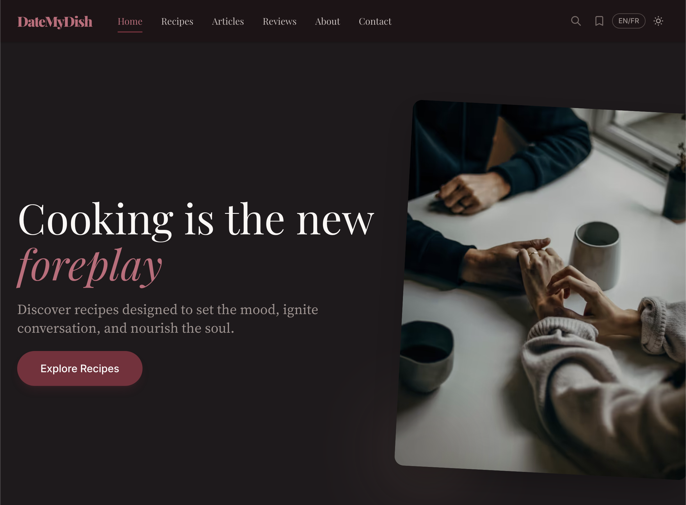

<div align="center">

### Where to go, what to drink, what to make for someone.

A bilingual (English and Quebec French) Montréal date-night guide: restaurant and bar reviews, date spots, chef interviews and the recipes chefs make at home.

**[datemydish.com](https://datemydish.com)**

[](https://astro.build)
[](https://typescriptlang.org)
[](https://tailwindcss.com)
[](https://workers.cloudflare.com)
[](https://playwright.dev)
[](#license)

</div>

<br />

<p align="center">
  
  
</p>

---

## Table of Contents

- [About](#about)
- [Post types](#post-types)
- [How content is published](#how-content-is-published)
- [Tech Stack](#tech-stack)
- [Getting Started](#getting-started)
- [Project Structure](#project-structure)
- [Commands](#commands)
- [Automation](#automation)
- [Brand](#brand)
- [License](#license)

## About

Date My Dish is a Montréal-first guide to date nights, reported by Victor. Every post is published in English and Quebec French. There are no scores: each Review and Date Spot carries a qualitative verdict (`A favourite`, `Depends on the night`, `Not our first pick`) with its reason, and reasoned Good-for rows. A venue's Google rating appears only as its own dated snapshot.

The full rules (what each post must contain, SEO, performance budgets, the publishing flow) live in [`docs/editorial-publishing-system.md`](docs/editorial-publishing-system.md). Domain terms are in [`CONTEXT.md`](CONTEXT.md).

## Post types

| Post type | English URL | French URL |
|---|---|---|
| Review (restaurant or bar) | `/en/reviews/{neighbourhood}/{slug}/` | `/fr/critiques/{neighbourhood}/{slug}/` |
| Date Spot (activity or chef-led experience) | `/en/date-spots/{slug}/` | `/fr/lieux/{slug}/` |
| Chef | `/en/chefs/{slug}/` | `/fr/chefs/{slug}/` |
| Chef Recipe Card | `/en/recipe-cards/{slug}/` | `/fr/fiches-recettes/{slug}/` |

The pages form a loop: a review's "Make a night of it" opens Date Spots, a Date Spot's "Pair it with" opens reviews, and a review links to its chef's page and recipe card. Home recipes and informative articles from the old site are retired (404).

## How content is published

- **Notion is the source.** Posts are written in a public, read-only Notion database. The site never writes to it and never rewrites its prose; only a short list of Allowed Edits (spelling, punctuation, em-dash removal, meta fields, alt text, internal links) applies.
- **The Importer** is a Claude cloud routine ([`routines/importer.md`](routines/importer.md)) that runs `scripts/notion-import.mjs`. It fetches the next eligible row, optimises its photos, fits the text into the page sections, translates it into Quebec French, pre-fills the post's Companion File (`src/content/editorial/{slug}.json`: verdict, signals, neighbourhood, meta fields, alt text, links) and opens a draft PR.
- **Checks** run in the routine and again in CI: the Verbatim Check (every sentence traces to Notion), the publish gate, the content contracts, the source and build validators and the performance budgets.
- **Merging the PR publishes.** Nothing else does.

## Tech Stack

| Layer | Technology |
|---|---|
| **Framework** | [Astro](https://astro.build) + TypeScript (strict) |
| **Styling** | [Tailwind CSS](https://tailwindcss.com) with class-based dark mode |
| **Content** | JSON collections validated by Zod contracts (`src/content-contracts/`), with Companion Files merged over them |
| **Source** | Read-only public Notion database, fetched with `notion-client` |
| **Search** | [Pagefind](https://pagefind.app), static search index |
| **i18n** | Subdirectory routing (`/en/`, `/fr/`) with type-safe translations |
| **Hosting** | [Cloudflare](https://workers.cloudflare.com) via Wrangler |
| **Testing** | [Playwright](https://playwright.dev) E2E, [Lighthouse CI](https://github.com/GoogleChrome/lighthouse-ci), Node contract tests |

## Getting Started

**Prerequisites:** Node.js 24 (as in CI)

```bash
git clone https://github.com/victortrinh/date-my-dish.git
cd date-my-dish
npm install
npm run dev
```

## Project Structure

<details>
<summary><strong>Click to expand</strong></summary>

```
src/
├── components/
│   ├── date-spots/           # Review page sections (essentials card, verdict, photos)
│   └── profiles/             # Chef page and recipe card
├── content/
│   ├── date-spots.json       # Reviews and Date Spots
│   ├── extended-profiles.json  # Chefs
│   ├── contributor-recipes.json  # Chef Recipe Cards
│   └── editorial/            # Companion Files, one per post
├── content-contracts/        # Zod contracts for every collection and the Companion File
├── i18n/                     # Translations and URL builders
├── layouts/                  # BaseLayout, DateSpotLayout
├── pages/{en,fr}/            # Routes
└── worker.ts                 # Cloudflare worker (maintenance mode, redirects)
notion/                       # published.json and the Notion source snapshots
routines/                     # Prompts for the Claude cloud routines
scripts/                      # Importer, validators, SEO and Pinterest scripts
tests/                        # Contract tests, Playwright specs, fixtures
```

</details>

## Commands

| Command | Description |
|---|---|
| `npm run dev` | Start the dev server |
| `npm run build` | Production build, gated by every validator |
| `npm run check` | TypeScript and content contract validation |
| `npm run test:contracts` | Content contract and Importer tests |
| `npm run validate:source` | Pre-build guards |
| `npm run validate:build` | Post-build guards against `dist/` |
| `npm run notion:list` | List the eligible Notion rows |
| `npm run preview` | Build and run the Cloudflare worker locally |
| `npm run deploy` | Build and deploy |
| `npx playwright test` | Playwright E2E tests |

## Automation

| Job | Runs as | What it does |
|---|---|---|
| Importer | Claude cloud routine, Wednesdays | Imports the next Notion row into a draft PR |
| Weekly SEO maintenance | Claude cloud routine, Sundays | Fixes Companion File meta, alt text and links; reports prose suggestions as an issue |
| `playwright-pr-check.yml` | Pull requests | Content contracts, Importer check, E2E smoke tests |
| `lighthouse-pr-check.yml` | Pull requests | Performance budgets and Lighthouse scores per post type |
| `weekly-seo-ranking.yml` | Mondays | Search Console and SERP data into `data/seo/` |
| `weekly-seo-audit.yml` | Sundays | Full Lighthouse audit into `data/lighthouse/` |
| `venue-maintenance.yml` | Monthly | Flags reviews and Date Spots due a recheck |
| `social-post-on-deploy.yml` | Publish PR merged | Queues pins for newly published posts (images in `data/pinterest/`) as a PR |
| `pinterest-pin-rotation.yml` | Daily | Posts queued pins |
| `token-refresh.yml` | 1st and 25th | Refreshes the Pinterest token |
| `playwright-weekly.yml` | Sundays | Full E2E suite |
| `auto-merge.yml` | Renovate PRs | Merges dependency updates that pass |

No job edits prose on the site.

## Brand

| Element | Value |
|---|---|
| **Primary** | Terracotta `#C4704B` (decorative) / `#9A5439` (text, WCAG AA) |
| **Accent** | Warm Gold `#D4A853` (decorative) / `#7D631C` (text, WCAG AA) |
| **Headings** | Playfair Display 400-900 (italic) |
| **Body** | Source Serif 4 400-700 |
| **UI** | Inter 400-700 |
| **Handwritten** | Caveat 400/700 |

## License

All rights reserved. Content, photos and code are proprietary.

---

<div align="center">

Built with care by **[Victor](https://datemydish.com/en/about/)** in Montréal

</div>
