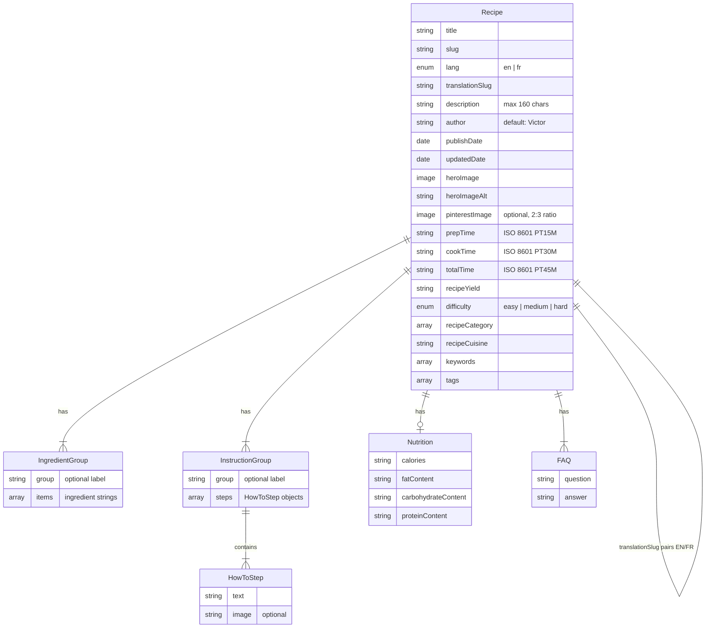

# Date My Dish: WordPress to Astro Migration Plan

## Context

datemydish.com is a bilingual recipe blog currently on WordPress (Kale Pro theme + WP Recipe Maker) hosted on NameHero. It suffers from persistent SEO errors and Google Search Console issues. The goal is to rebuild it as a high-performance static site optimized for Google rich results and AI chat visibility (ChatGPT, Perplexity, Claude, Google AI Overview). Under 20 recipes exist today. Data lives in Notion (used as drafting tool only). Victor writes recipes in English and translates to French manually.

## Tech Stack

| Layer | Technology |
|---|---|
| Framework | Astro 5.x + TypeScript |
| Content | MDX files with Content Collections (Zod-validated frontmatter) |
| Hosting | Cloudflare Pages (free unlimited bandwidth, 300+ edge locations) |
| Styling | Tailwind CSS |
| i18n | Astro built-in i18n, subdirectories (`/en/`, `/fr/`) |
| Images | Astro `<Picture>` (auto AVIF/WebP, responsive srcset) |
| Search | Pagefind (static, zero-JS until interaction) |
| Structured Data | JSON-LD (Recipe + FAQPage + BreadcrumbList schemas) |
| AI Visibility | `llms.txt` + GEO content patterns + AI-friendly `robots.txt` |
| Analytics | Cloudflare Web Analytics |

---

## Phase 1: Foundation

**Goal**: Scaffold Astro project with TypeScript, Tailwind, i18n routing, base layouts.

### Files to create
- `package.json` -- Astro 5.x, `@astrojs/mdx`, `@astrojs/sitemap`, `@astrojs/tailwind`, `sharp`
- `astro.config.ts` -- site URL, i18n config (`locales: ['en', 'fr']`, `prefixDefaultLocale: true`), sitemap with hreflang, MDX integration
- `tsconfig.json` -- strict mode, path aliases (`@components/*`, `@layouts/*`, `@i18n/*`, `@assets/*`)
- `tailwind.config.mjs` -- brand colors (#1863DC blue, #5A822B green), font families (Bitter, Fira Sans Condensed, Caveat, Raleway)
- `src/styles/global.css` -- Tailwind directives, Google Fonts imports, base typography
- `src/i18n/en.json` + `src/i18n/fr.json` -- translation dictionaries (nav, recipe UI, categories, SEO templates)
- `src/i18n/utils.ts` -- `t()` function, `getLocaleFromUrl()`, `getLocalizedPath()`, `getAlternateUrl()`
- `src/layouts/BaseLayout.astro` -- `<html lang>`, SEOHead, Navigation, Footer, analytics
- `src/layouts/RecipeLayout.astro` -- extends BaseLayout, renders JSON-LD, hero image, recipe metadata bar, FAQ section, related recipes
- `src/pages/index.astro` -- root redirect to `/en/` (browser language detection with fallback)

### Acceptance criteria
- `npm run dev` starts without errors
- `/en/` and `/fr/` render with correct `lang` attribute
- `t('en', 'nav.home')` returns `'Home'`, `t('fr', 'nav.home')` returns `'Accueil'`
- Root `/` redirects to `/en/`

---

## Phase 2: Content Architecture

**Goal**: Define Content Collections schema, MDX setup, Recipe JSON-LD component.

### Content model



### Files to create
- `src/content.config.ts` -- Zod schemas for Recipe with all fields above, using `image()` helper for build-time validation, `glob` loader for `**/*.mdx`
- `src/components/RecipeSchema.astro` -- generates complete JSON-LD for `schema.org/Recipe` + `FAQPage` (if FAQs exist). Flattens ingredient groups into `recipeIngredient` array, builds `HowToStep`/`HowToSection` from instructions.
- Example recipe: `src/content/recipes/en/chocolate-crepes.mdx` -- demonstrates all frontmatter fields + MDX body prose

### Key decisions
- Ingredients/instructions live in frontmatter YAML (needed for JSON-LD generation)
- MDX body is the SEO blog prose (800-1500 words target)
- `translationSlug` links EN/FR pairs without a mapping file
- Images in `src/assets/` (not `public/`) for Astro's optimization pipeline

### Acceptance criteria
- `astro check` passes with zero errors
- Missing required frontmatter fields cause clear build errors
- RecipeSchema generates valid JSON-LD passing Google Rich Results Test structure

---

## Phase 3: Pages & Components

**Goal**: Build all page templates and UI components.

### Components to create
- `src/components/SEOHead.astro` -- title template, meta description, canonical (self-referencing), hreflang (bidirectional EN/FR + x-default), Open Graph, Twitter Cards, Pinterest rich pin meta
- `src/components/Navigation.astro` -- logo, nav links (translated), language toggle, mobile menu (CSS-only, no JS), search icon
- `src/components/LanguageToggle.astro` -- switches language preserving current page, resolves `translationSlug` for recipe pages
- `src/components/Footer.astro` -- social links (Instagram, Pinterest), nav, copyright
- `src/components/RecipeCard.astro` -- card for listings with `<Picture>` hero image, title, description, prep time, difficulty badge
- `src/components/RecipeContent.astro` -- ingredient checkboxes (CSS-only), numbered instructions, print styles, `id="recipe"` anchor
- `src/components/JumpToRecipe.astro` -- prominent button, scrolls to `#recipe`
- `src/components/FAQSection.astro` -- `<details>/<summary>` accordions (no JS)
- `src/components/RelatedRecipes.astro` -- grid of 2-3 related RecipeCards
- `src/components/Breadcrumbs.astro` -- accessible breadcrumbs + `BreadcrumbList` JSON-LD
- `src/components/SearchBar.astro` -- Pagefind UI wrapper (deferred load on focus)

### Pages to create
- `src/pages/en/index.astro` + `fr/index.astro` -- hero, featured recipes, category quick-links
- `src/pages/en/recipes/index.astro` + `fr/recettes/index.astro` -- recipe listing, filterable by category
- `src/pages/en/recipes/[...slug].astro` + `fr/recettes/[...slug].astro` -- individual recipe (queries Content Collection, resolves translation for hreflang)
- `src/pages/en/recipes/category/[category].astro` + `fr/recettes/categorie/[category].astro` -- category hub pages (topical authority)
- `src/pages/en/about.astro` + `fr/a-propos.astro` -- about Victor (E-E-A-T signals)
- `src/pages/en/contact.astro` + `fr/contact.astro`
- `src/pages/en/search.astro` + `fr/recherche.astro` -- search page (`noindex`)

### Acceptance criteria
- Language toggle preserves page context (recipe -> translated recipe)
- Mobile nav works without JavaScript
- Recipe pages have Jump to Recipe, ingredient checkboxes, print stylesheet
- Category pages filter correctly
- All images use `<Picture>` with AVIF/WebP

---

## Phase 4: SEO Infrastructure

**Goal**: Sitemaps, robots.txt, llms.txt, redirects, all meta tags.

### Files to create
- `public/robots.txt` -- Allow all + AI crawlers (GPTBot, ClaudeBot, PerplexityBot, Google-Extended), sitemap reference
- `src/pages/llms.txt.ts` -- dynamic endpoint listing all recipes with titles and URLs
- `public/_redirects` -- 301 redirects from old WordPress URLs to new Astro URLs, www->apex, root->/en/
- `public/_headers` -- security headers, long-cache for `/_astro/*` and `/pagefind/*`

### Already handled by Phases 1-3
- Sitemap with hreflang: `@astrojs/sitemap` in `astro.config.ts`
- Canonical + hreflang: `SEOHead.astro`
- Recipe + FAQPage JSON-LD: `RecipeSchema.astro`
- BreadcrumbList JSON-LD: `Breadcrumbs.astro`
- Open Graph + Twitter Cards: `SEOHead.astro`

### Acceptance criteria
- `/robots.txt` lists AI crawlers and sitemap
- `/llms.txt` dynamically lists all recipes
- `/sitemap-index.xml` contains sub-sitemaps with hreflang
- Every page has self-referencing canonical + bidirectional hreflang
- Old WordPress URLs 301 redirect to new URLs
- All recipe pages pass Google Rich Results Test

---

## Phase 5: Search & Performance

**Goal**: Pagefind integration, image pipeline, Core Web Vitals.

### Implementation
- Build script: `astro build && npx pagefind --site dist`
- Pagefind data attributes: `data-pagefind-body` on content, `data-pagefind-filter="lang:{lang}"`
- SearchBar loads Pagefind JS only on focus (zero initial JS)
- Hero images: `loading="eager"` + `fetchpriority="high"`
- Listing images: `loading="lazy"` + `decoding="async"`
- Fonts: `font-display: swap` + preload critical fonts

### Acceptance criteria
- Search returns results filtered by current language
- Lighthouse: Performance >= 95, Accessibility >= 95, SEO >= 95
- CLS < 0.1, LCP < 2.5s, INP < 200ms

---

## Phase 6: Content Migration

**Goal**: Migrate all existing WordPress recipes (under 20) to MDX.

### Per recipe
1. Extract from WordPress: title, description, ingredients, instructions, images, times, nutrition, categories, old URL slug
2. Create `src/content/recipes/en/{slug}.mdx` with all frontmatter + 800-1500 word blog prose + 3-5 FAQs
3. Create `src/content/recipes/fr/{slug-fr}.mdx` (Victor translates manually)
4. Process images: descriptive filenames, Pinterest 2:3 variant, place in `src/assets/images/recipes/`
5. Add old URL to `public/_redirects`

### Acceptance criteria
- All recipes exist as EN + FR MDX pairs
- `astro check` passes
- Every recipe has valid JSON-LD and >= 3 FAQs
- All images have descriptive filenames and alt text

---

## Phase 7: Deployment

**Goal**: Deploy to Cloudflare Pages with custom domain.

### Steps
1. Connect GitHub repo to Cloudflare Pages (build: `npm run build`, output: `dist`)
2. Add custom domain `datemydish.com` + `www.datemydish.com` (www redirects to apex)
3. DNS CNAME records -> `*.pages.dev`
4. SSL Full (strict), automatic certificates
5. Environment: `NODE_VERSION=18`

### Acceptance criteria
- Site live at `https://datemydish.com/en/`
- SSL works, www redirects to apex
- Old URLs redirect correctly, build < 2 minutes

---

## Phase 8: Claude Skills

**Goal**: Create 5 skills in `.claude/commands/` to compound the workflow.

1. **`new-recipe.md`** -- Scaffolds EN + FR MDX pair with all required frontmatter, validates with `astro check`
2. **`seo-audit.md`** -- Audits recipe for frontmatter completeness, JSON-LD validity, hreflang, content quality, outputs scorecard
3. **`translate-recipe.md`** -- Assists EN<->FR translation with localized SEO keywords and culinary terms
4. **`deploy.md`** -- Pre-deploy checks, git commit, push (triggers Cloudflare auto-deploy), post-deploy verification
5. **`optimize-image.md`** -- Renames images descriptively, resizes, generates Pinterest 2:3 variant, outputs frontmatter paths

---

## Phase 9: Post-Launch

- Google Search Console: verify domain, submit sitemaps, check hreflang
- Rich Results Test: every recipe page
- Cloudflare Analytics verification
- 301 redirect verification (curl every old URL)
- Lighthouse audit: homepage, recipe page, listing page
- Social share testing: Facebook OG, Twitter Cards, Pinterest Rich Pins
- Decommission old WordPress hosting

---

## Verification Plan

After each phase: `npx astro check` + `npm run build` + visual inspection.

End-to-end after Phase 7:
- Visit every page in both languages
- Verify language toggle on every page type
- Validate JSON-LD on 3 recipe pages via Rich Results Test
- Check robots.txt, llms.txt, sitemap-index.xml
- Test old URL redirects
- Lighthouse on 3 page types
- Share recipe URL on Facebook/Twitter for OG preview

---

## File Inventory (~85-110 files)

```
package.json, astro.config.ts, tsconfig.json, tailwind.config.mjs, .gitignore

src/
  content.config.ts
  styles/global.css
  i18n/en.json, fr.json, utils.ts
  layouts/BaseLayout.astro, RecipeLayout.astro
  components/SEOHead.astro, Navigation.astro, LanguageToggle.astro,
    Footer.astro, RecipeCard.astro, RecipeSchema.astro,
    RecipeContent.astro, JumpToRecipe.astro, FAQSection.astro,
    RelatedRecipes.astro, Breadcrumbs.astro, SearchBar.astro
  pages/
    index.astro, llms.txt.ts
    en/ (index, search, about, contact, recipes/index, recipes/[...slug], recipes/category/[category])
    fr/ (index, recherche, a-propos, contact, recettes/index, recettes/[...slug], recettes/categorie/[category])
  content/recipes/en/*.mdx, fr/*.mdx (~20 each)
  assets/images/recipes/*.jpg (~20-40 images)

public/robots.txt, favicon.svg, _redirects, _headers
.claude/commands/new-recipe.md, seo-audit.md, translate-recipe.md, deploy.md, optimize-image.md
```
